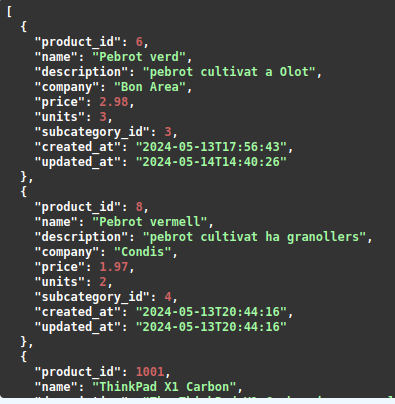
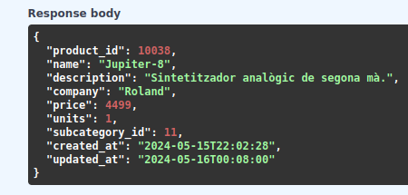
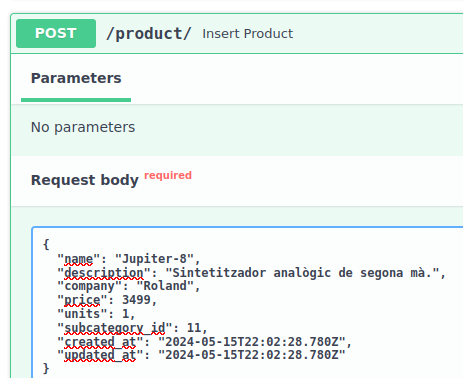
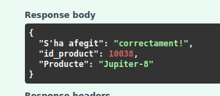
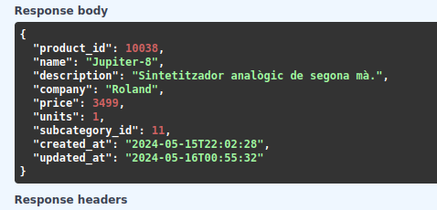
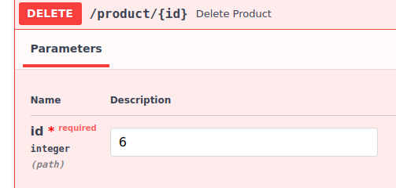
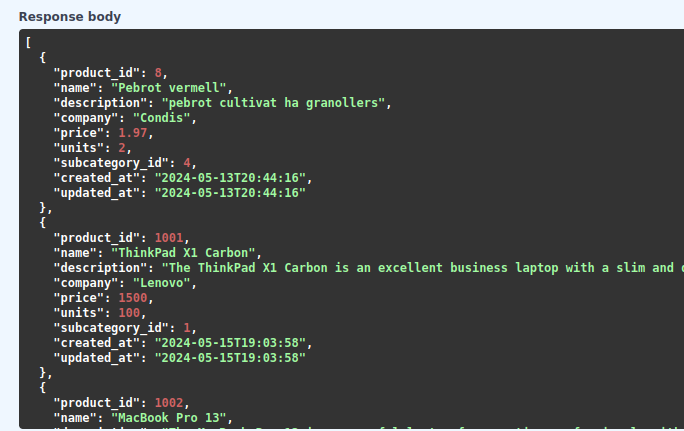
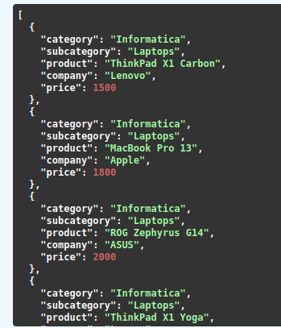
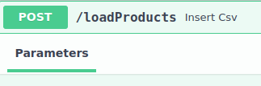
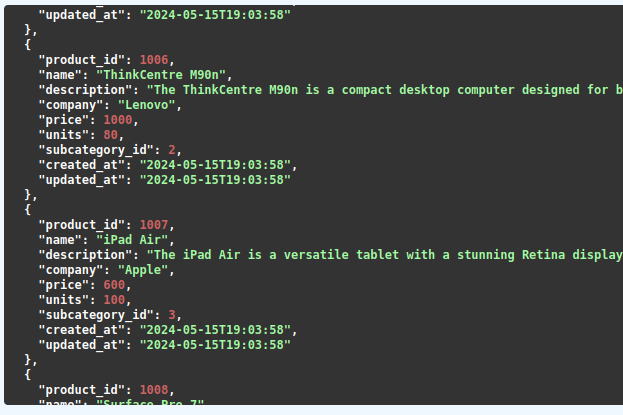

**FastApi_Botiga**

Api rest amb fastapi de una botiga

# Pràctica: Fastapi

La pràctica consistia en dues parts:

        -CRUD
        -Carga massiva des d'un arxiu .csv

A la primera part s'havia de fer un conjunt de mètodes amb els seus 'Endpoints' i les seves rutes per poder provar els mètodes des del "Swagger" (també es pot fer des del propi navegador).

Només tenen crides als mètodes on és desenvolupava la lògica de la consulta i un 'return' amb format diccionari.

Dins la clase 'botiga_db' es fa tota la lògica, tipus de consultas i relacions entre mètodes de manera modular.

Cada mètode obre, actualitza (si és necessari) i tanca la connexió a la base de dades.

Aqui tenim un conjunt de consultes per comprobar el funcionament de la Api rest 'Fastapi'.

Primer hem realitzat el mètode per obtenir tots el productes:

Acte seguit la comprovació del mètode getId:

Per continuar em fet un post:

Acte seguit comprovem el mètode de modificar el price, el posarem a 3499.

Eliminem el producte amb el id igual 6, surt a la primera foto (pebrot verd) 

Per acabar el primer apartat, l'ùltim mètode habiem d'agafar alguns camps de les 3 taules.

El segon apartat consistia en fer un mètode que obris una arxiu .csv, recorre l'arxiu, i que vagi comparant les ids del .csv amb les ids de la taula corresponen, si el id no existeix, es pot fer un insert, sino, s'ha d'actualitzar la taula amb les noves dades.

comprovació:

